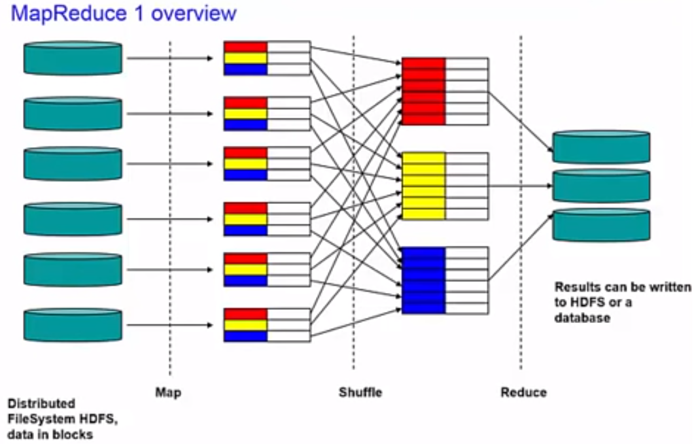

# Introduction to MapReduce & YARN
## Hadoop V1 (MapReduce Model V1)
- The basic concept of MapReduce is to distribute data across a large cluster of machines and then instead of bringing our data to the programs (i.e. in traditional programs), we write our programs in such a way which allows our programs to be brought near the data.
- > The entire cluster plays its part in both reading the data as well as processing the data.
- Adding more nodes to the cluster increases the capacity of the file system as well as it increases the **Processing power** and **Parallelism**.
- The **Hadoop distributed file system** (i.e. HDFS) is responsible for spreading the data across the entire cluster by assuming the cluster as one giant file system. When a file is written to cluster, blocks of the file are spread out and **replicated** across the entire cluster. In the diagram below we can see that every block of file is replicated to 3 machine.
- The **default replication factor is 3, 2 chuncks on the same rack and 1 on other**.
- 
### Phases of MapReduce
#### Map Phase
- In this phase the required job is divided into small pieces and distributed across the nodes in the cluster, where each node **processes its piece of the pie**. The processing is done in parallel, making the process very efficient.
#### Shuffle phase
- In this phase interim output from map phase is transferred to the reduce phase. There may also be a **Sort Phase** which covers the **merging and sorting** of map outputs.
#### Reduce Phase
- This phase distills down the results from shuffle and sort phase to a single set of results.
## MapReduce V1 Engine
- MR1 uses master/slave architecture with **1 Job Tracker and multiple Task Trackers**.
- **Job Tracker**
    - Accepts MR jobs submitted by clients.
    - Pushes MR tasks to Task trackers.
    - Keeps the work as close to the data as possible.
    - Monitors tasks and Task Trackers status.
- **Task Tracker**
    - Runs MR Tasks.
    - Reports status to Job Tracker.
    - Manages storage and transmission of intermediate output.
- 
- If 1 task tracker is very slow, it can delay the entire MR job especially toward the end of the job where everything can end up waiting for the slowest task.
- With Speculative execution enabled, a single task can be competitively executed on multiple slave nodes in parallel.
- For job scheduling, hadoop by default uses FIFO, with 5 optional scheduling priorities to schedule jobs from a work queue. Other scheduling algorithms like **Capacity Scheduler and Fair Scheduler** are available as Add-ins.
- For MR job, the job tracker breaks down the job into Map step and Reduce step, finds where the blocks of file are located and then assigns the respective worker nodes, tasks of Map and Reduce Processing.
- In the Map step, each worker nodes who is allocated work, takes its designated block of input, reads it and then performs the map processing on it. It also produces an output for each of the reducer node.
- > Each Map Node stores its results in the local file system where the reducer is able to access it.
- In the reduce step, the answers generated to sub-problems in map step, are sent to reducers nodes where they are combined or aggregated in some way to produce the final output.
## MapReduce Overview

- This slide provides an overview of the overall mapreduce process. Six blocks stored on different data nodes in HDFS are read and processed by Map Tasks running on the data nodes where the blocks are stored. The output of the map task are shuffled , then sent to the reducer task **(1 output file from each mapper task to each reducer task)**. the interim files exchanged between mapper and reducer, are not duplicated and are stored local to mapper.  
- The reducers produce the output which is stored in HDFS, 1 output file per reducer, and they are replicated.  
- A mapper is a relatively small program with 1 simple task, It is responsible for reading 1 small portion of the input file (i.e. 1 block of 1 file), **interpreting, filtering or transforming** the data as necessary and then **producing a stream of <key, value> pairs**.  
- The key,value paris don't need to be simple, they can be as large and as complex as the job at hand require.
- The next phase is called **Shuffle** and is orchestrated behind the scenes by the mapreduce logic that is part of hadoop. The idea here is that all of the data that is emitted by the mappers is first **locally grouped by the key** that our program chose, and then **for each of the key a node is chosen to process all of the values for that key, from all mappers**.  
- Lets says we chose US states, then 1 reducer will be sent NewYork data, 1 California and so on.  
- > Shuffle distributes keys using a **partition class normally hash partition**. The hash function is running on the mapper node and it determines which reducer node will receive which key,value pairs.  
- **Combiner phase**: Rather than sending multiple key/value pairs with the same key value to the Reducer node, the values are combined into one key/value pair. This is only possible where the **reduce function is additive (that is, does not lose information when combined)**. Since only one key/value pair is sent, the file transferred from Mapper node to Reducer node is smaller and network traffic is minimalized.
    - The combiner task runs on the mapper nodes, when it is run, it pre-processes the intermediate data files on each mapper node. It pre-merges and pre-aggregates the data, that will be sent to the reducer nodes, and this speeds up the process as smaller files need to be transmitted to the reducer.
- Commonly the **number of reduce tasks < number of map tasks**.
- **Each mapper task produces 1 file for each reducer task.**
## Hadoop V2 (MapReduce Model V2)
### YARN
### Compare Hadoop v2 to v1