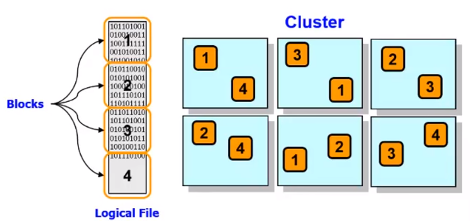
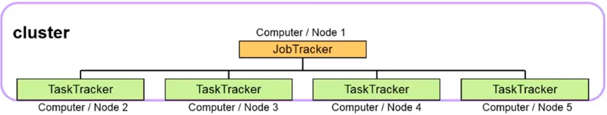

# Introduction to MapReduce & YARN
## Hadoop V1 (MapReduce Model V1)
- The basic concept of MapReduce is to distribute data across a large cluster of machines and then instead of bringing our data to the programs (i.e. in traditional programs), we write our programs in such a way which allows our programs to be brought near the data.
- > The entire cluster plays its part in both reading the data as well as processing the data.
- Adding more nodes to the cluster increases the capacity of the file system as well as it increases the **Processing power** and **Parallelism**.
- The **Hadoop distributed file system** (i.e. HDFS) is responsible for spreading the data across the entire cluster by assuming the cluster as one giant file system. When a file is written to cluster, blocks of the file are spread out and **replicated** across the entire cluster. In the diagram below we can see that every block of file is replicated to 3 machine.
- The **default replication factor is 3, 2 chuncks on the same rack and 1 on other**.
- 
### Phases of MapReduce
#### Map Phase
- In this phase the required job is divided into small pieces and distributed across the nodes in the cluster, where each node **processes its piece of the pie**. The processing is done in parallel, making the process very efficient.
#### Shuffle phase
- In this phase interim output from map phase is transferred to the reduce phase. There may also be a **Sort Phase** which covers the **merging and sorting** of map outputs.
#### Reduce Phase
- This phase distills down the results from shuffle and sort phase to a single set of results.
## MapReduce V1 Engine
- MR1 uses master/slave architecture with **1 Job Tracker and multiple Task Trackers**.
- **Job Tracker**
    - Accepts MR jobs submitted by clients.
    - Pushes MR tasks to Task trackers.
    - Keeps the work as close to the data as possible.
    - Monitors tasks and Task Trackers status.
- **Task Tracker**
    - Runs MR Tasks.
    - Reports status to Job Tracker.
    - Manages storage and transmission of intermediate output.
- 
- If 1 task tracker is very slow, it can delay the entire MR job especially toward the end of the job where everything can end up waiting for the slowest task.
- With Speculative execution enabled, a single task can be competitively executed on multiple slave nodes in parallel.
- For job scheduling, hadoop by default uses FIFO, with 5 optional scheduling priorities to schedule jobs from a work queue. Other scheduling algorithms like **Capacity Scheduler and Fair Scheduler** are available as Add-ins.

### Limitations of Hadoop V1
## Hadoop V2 (MapReduce Model V2)
### YARN
### Compare Hadoop v2 to v1